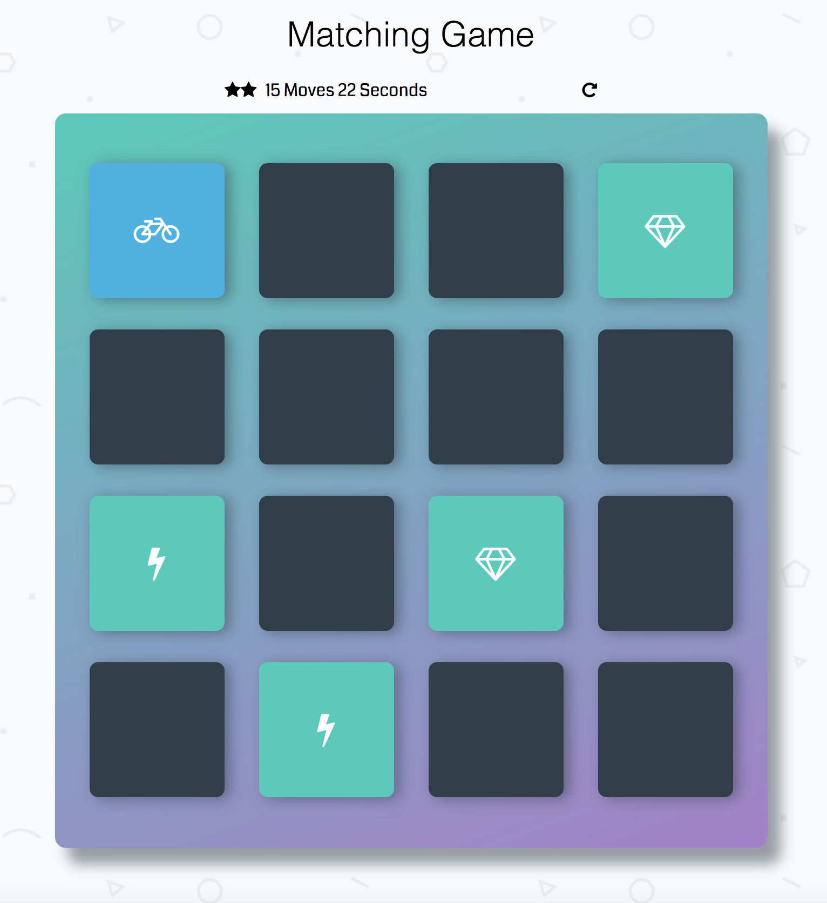

# Memory Game Project

A card matching game that relies on Vanilla JS without any external libraries. Start by clicking on a card and try to match it with another card.

## Table of Contents

* [Instructions](#instructions)
* [Features](#features)
* [Dependencies](#dependencies)
* [Inside the game](#inside)

## Instructions

* Load this link in your browser https://ivailionyte.github.io/fend-project-memory-game/
* Click on a card
* Keep searching for the same cards and working your memory to remember each clicked card.
* Match cards with less moves and in faster time

## Features

* Counting your moves
* Live time tracking
* Rating system based on moves
* Restart button

## Dependencies

* Game relies on Vanilla JS.
* Game was created without any external libraries.

## Inside the game

